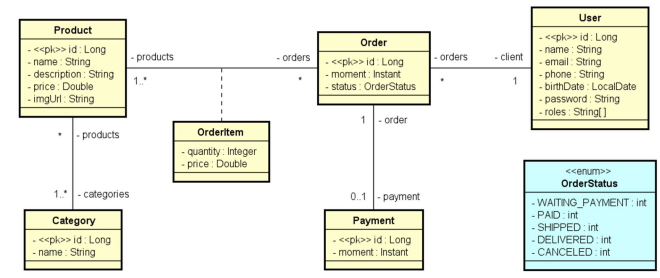
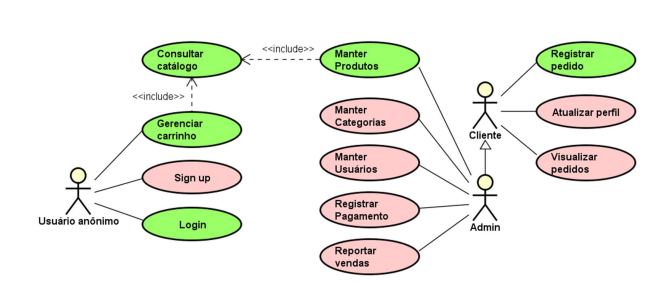

# DSCommerce 

API REST de um sistema de e-commerce desenvolvida como **desafio prático do curso Java Spring Professional (DevSuperior)**.  
O projeto simula um cenário real de desenvolvimento backend, cobrindo desde a modelagem de domínio até segurança e controle de acesso.

---

## Visão Geral

O **DSCommerce** é uma aplicação backend responsável pelo gerenciamento de produtos, categorias, usuários e pedidos.  
O sistema disponibiliza funcionalidades públicas (catálogo e carrinho) e áreas restritas para clientes autenticados e administradores, seguindo boas práticas de arquitetura REST.

O desenvolvimento foi guiado por um **documento formal de requisitos** e protótipos de tela, simulando um ambiente profissional de projeto.

---
## Modelo de Domínio


O projeto explora diferentes tipos de relacionamentos do JPA/Hibernate:

- **Many-to-One**
  - Pedido → Usuário

- **Many-to-Many**
  - Produto ↔ Categoria

- **Classe de Associação**
  - Item de Pedido (*OrderItem*), armazenando:
    - Produto
    - Quantidade
    - Preço no momento da compra (histórico)

---

## Funcionalidades Principais

- **Catálogo de Produtos**
  - Listagem paginada
  - Filtro por nome
  - Ordenação alfabética

- **Carrinho de Compras**
  - Adição e remoção de produtos
  - Alteração de quantidades
  - Cálculo automático de subtotal e total

- **Pedidos**
  - Registro de pedido a partir do carrinho
  - Controle de status do pedido
  - Histórico de pedidos por usuário

- **Área Administrativa**
  - CRUD de produtos
  - CRUD de categorias
  - Controle de usuários
  - Acesso restrito por perfil

---
## Casos de Uso



## Segurança e Controle de Acesso

A aplicação implementa autenticação e autorização utilizando **OAuth2 + JWT**, com controle baseado em perfis (RBAC):

| Perfil            | Permissões |
|-------------------|------------|
| **Visitante**     | Visualizar catálogo e gerenciar carrinho |
| **Cliente**       | Registrar pedidos e visualizar apenas seus próprios pedidos |
| **Administrador** | Acesso total ao sistema (produtos, categorias e usuários) |

Além disso, o sistema aplica **proteção de recursos por usuário** (*self access*), garantindo que clientes só acessem seus próprios dados.

---


## Tecnologias Utilizadas

### Backend
- Java 17+
- Spring Boot 3
- Spring Web
- Spring Data JPA
- Hibernate

### Segurança
- Spring Security
- OAuth2
- JWT

### Banco de Dados
- H2 (ambiente de testes)

### Validação e Utilidades
- Bean Validation (Jakarta Validation)
- Maven

---

## Protótipos e Documentação

- **Protótipos de Tela (Figma)**  
  https://www.figma.com/design/ZrGNVNG0kZL6txDv4G8P6s/DSCommerce

- **Documento de Requisitos**  
  Baseado no padrão utilizado nos cursos da DevSuperior, descrevendo:
  - Premissas
  - Casos de uso
  - Modelo conceitual
  - Regras de negócio

---

## Como Executar o Projeto

### Pré-requisitos
- JDK 17 ou superior
- Maven

### Passos

```bash
1-Clonar o repositório
git clone https://github.com/willAtaides/DS-Commerce.git

2-Abra o projeto na sua IDE.

3-Localize a classe principal da aplicação (DsCommerceApplication).

4-Execute a aplicação através da IDE (Run / Run As > Spring Boot App).

Ao iniciar a aplicação:

O banco de dados H2 será configurado automaticamente

Os dados iniciais (seeding) serão carregados para facilitar os testes.

Caso queira consultar o banco :
http://localhost:8080/h2-console
usuario :sa
senha: (semsenha)
```


